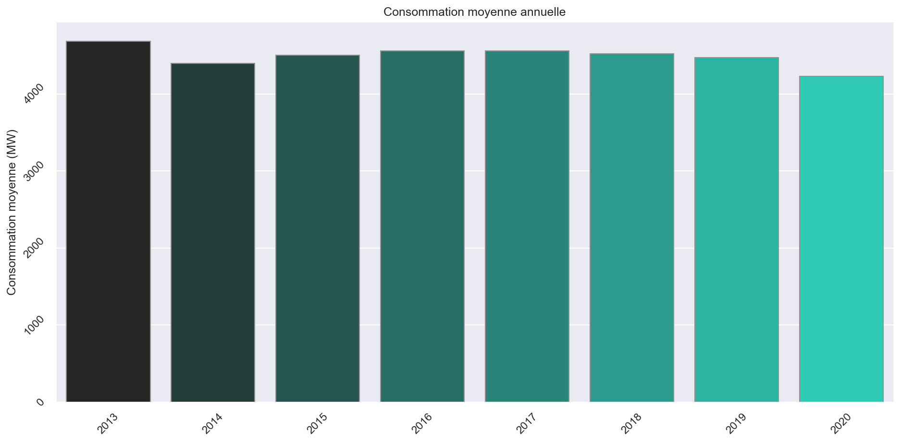

# Projet EnerPy, avec Datascientest

***Promotion Data Analyst Juin-2021 Bootcamp***

*Participants* :
* Deborah Kerr - Data Analyst
* Didier Pezet - Data Analyst
* Simon Jaricot - Data Analyst

EnerPy a pour but d'analyser la consommation et la production d'énergie en France sur une période allant de 2013 à 2020 afin de déterminer s'il y a de potentiels risques de blackout, d'estimer l'évolution de la consommation et de la production.

---

# 1 - Contexte

Dans le cadre de la formation Data Analyst proposée par Datascientest, une liste de projets nous a été soumise afin de mettre en oeuvre les concepts que nous avons appris.

Le choix de notre équipe s'est porté sur un projet concernant l'analyse de la production et la consommation d'énergie en France que nous avons nommé ***EnerPy***, puisque nous utiliseront le langage *Python*.

## 1.1 - Contexte économique

Les retombées économiques dans le domaine de l'énergie sont importantes lorsqu'on considère les investissements consentis dans les infrastructures et la R&D.

L'analyse et la prévision des données de consommation et de production sont primordiales pour que le modèle économique soit viable et pérenne. Une production trop élevée vis à vis de la consommation provoquera des pertes considérables d'énergie. D'autre part, les coûts de production seront trop élevés.

Il est intéressant de voir comment ENEDIS combine et module les différentes filières de production d’électricité, pour assurer la couverture de la consommation au meilleur coût, en intégrant les atouts et faiblesses de chacune.


## 1.2 - Contexte scientifique

Ce projet est une belle occasion pour nous de présenter, d'un point de vue scientifique, les analyses et les modèles que nous allons développer.

C’est aussi l’occasion d’entrevoir les spécificités des différentes filières liées aux phénomènes physiques mis en œuvre pour produire l’électricité.

Les analyses de production et de consommation donnent un aperçu des évolutions au cours des années, d'événements impactant et de la part des énergies renouvelables en France.

---

# 2 - Objectifs

## 2.1 - Définition

Les objectifs que nous allons tenter de remplir sont les suivants:

* analyse et prévision de la production
* analyse et prévision de la production éolienne et solaire
* analyse et prévision de la consommation
* analyse des énergies renouvelables

### 2.2 - Expertise

Nous n'avons pas travaillé dans le domaine de l'énergie mais l'intérêt de chacun d'entre nous et le travail effectué nous a poussé à développer une connaissance certaine dans le champ de la production d'énergies.

---

# 3 - Le dataset

Les données sont en libre accès sur le site [opendata.reseaux-energies.fr](https://opendata.reseaux-energies.fr/explore/dataset/eco2mix-regional-cons-def/information/?disjunctive.libelle_region&disjunctive.nature&sort=-date_heure).

**Les licences des jeux de données utilisés et listés ci-dessous sont soit [Etalab](https://www.etalab.gouv.fr/wp-content/uploads/2017/04/ETALAB-Licence-Ouverte-v2.0.pdf), soit [ODbL](http://osm.org/copyright)**

## 3.1 - Exploration du dataset

### 3.1.1 - Consommation et production

Le dataset décrit la consommation et la production selon les différentes filières (*Nucléaire*, *Thermique*, *Hydraulique*, *Eolien*, *Solaire*, *Bioénergies*, *Pompage* ) à un intervalle de 30 minutes, ce qui rend les données très précises.

Elles sont indiquées en ***MegaWatt***.

Les données de consommation et de production sont collectées en fonction des régions en France métropolitaine.

### 3.1.2 - Echanges Physiques
Il y a une variable *ech_physiques* qui indique lorsqu'une [région importe ou exporte de l'énergie](https://bilan-electrique-2020.rte-france.com/territoires-et-regions-equilibre-entre-production-et-consommation/). En d'autres termes, lorsque la valeur est négative, la région en question exporte et lorsqu'elle est positive, elle importe.  
D'autres variables commençant par `flux_physiques` doivent indiquer les réseaux d'échanges entre régions et avec les pays limitrophes. Malheureusement, ces flux ne sont pas exploitables dans le dataset étant donné qu'ils sont tous considérés comme nuls (valeurs à `NA`, `-` ou vide).

### 3.1.3 - Pompage

Les données concernant la variable pompage sont systématiquement négatives. Selon le site [encyclopedie-energie.org](https://www.encyclopedie-energie.org/les-stations-de-pompage-step/), le rendement d'une station de pompage (STEP) est de 75% à 85%. En d'autre termes, il faut consommer 1.25 MW pour produire 1 MW.

## 3.2 - Data Cleaning

Afin d'exploiter les données, il convient de nettoyer le dataset afin qu'il puisse répondre à nos besoins en DataViz' puis en Machine Learning.

### 3.2.1 - Suppression de données manquantes

Les données manquantes sur les lignes concernant les colonnes *consommation*, *thermique*, *nucleaire*, *eolien*, *solaire*, *hydraulique*, *pompage*, *bioenergies* sont supprimées. En effet, il n'est pas utile pour analyser la consommation et la production de garder des lignes où les informations nécessaires sont vides.

Les colonnes concernant les taux de charge (*tch_nucleaire*, ...) ne sont pas conservées.

Il en va de même pour les colonnes concernant les *flux_physiques* étant donné qu'ils sont tous vides.

### 3.2.2 - Modification des données

La colonne *date_heure* n'est pas identifiée comme un Timeserie et est donc transformée en ce format.

Concernant les données manquantes sur certaines colonnes, si la ligne (comme indiqué dans 1.3.1) n'est pas entièrement vide, les valeurs sont remplacées par `0`.

### 3.2.3 - Ajout de données

Des données temporelles sont ajoutées au dataset. Plutôt que d'utiliser un `timeserie`, il est plus simple d'utiliser `annee`, `mois`, `jour` avec certains modèles.

De même, les formats `dayofweek`, `saison`, `YYYY-MM-DD` et `YYYY-MM` sont ajoutés au dataframes.

## 3.3 - Ajout d'informations

Afin d'évaluer plus en détail les modèles concernant l'éolien et le solaire, des [données sur le rayonnement solaire et la vitesse du vent](https://opendata.reseaux-energies.fr/explore/dataset/rayonnement-solaire-vitesse-vent-tri-horaires-regionaux/information/?disjunctive.region) ([Weathernews France](http://www.weathernews.fr/)) ainsi que les [températures](https://opendata.reseaux-energies.fr/explore/dataset/temperature-quotidienne-regionale/information/?disjunctive.region) ([Weathernews France](http://www.weathernews.fr/)) sont fusionnées dans le dataset, disponibles sur le site [opendata.reseaux-energies.fr](https://opendata.reseaux-energies.fr)

Un point est à soulever: les données disponibles ne couvrent que les années allant de 2016 à aujourd'hui. De plus, les relevés sont espacés de 3h au lieu de 30 minutes dans le dataset initial.

Par conséquent, les datasets une fois fusionnés en forment un nouveau spécialement pour les modèles sur les énergies éoliennes et solaires afin de ne pas provoquer de perte d'information pour les autres modèles.

Les données [de coordonnées géographiques des régions](https://www.data.gouv.fr/en/datasets/contours-des-regions-francaises-sur-openstreetmap/) (© les contributeurs d'OpenStreetMap sous licence ODbL) ont été ajoutées pour réaliser des visualisations avec Geopandas. Elles visent à analyser la répartition de la production selon les régions.

## 3.4 Données importantes

Dans le but de remplir nos objectifs, nous avons détecté quelques variables importantes:

* `date_heure`: permet d'avoir une visualisation temporelle,
* `consommation`: indique la consommation à l'instant T en MW,
* les variables de production `nucleaire`, `eolien`, `solaire`, `hydraulique`, `thermique` et `bioenergies`,
* `region`: permet de distinguer les différences de consommation et production sur le territoire français.

## 3.5 - Variables cibles

Selon nos différentes analyse et modélisations, les variables cibles seront principalement la `consommation`, la `production` totale calculée.  

---

# 4 - DataViz'

## 4.1 - Visualisations de la production

### 4.1.1 - Production globale

Dans un premier temps, visualisons la production suivant les années.


On remarque une tendance à la baisse avec une année 2020 particulièrement basse. Nous étudierons les causes plus bas.

Nous pouvons aussi afficher la variation de la production suivant les mois avec, comme intervalle de confiance, l'écart-type.


On constate une forte baisse de la production pour les mois estivaux. Cela nous parait intuitif puisque la consommation suit la même tendance, sûrement expliquée, entre autres, par les besoins de chauffage.

Visualisons maintenant la production d'énergie suivant les régions.


On constate une grande disparité de production d'énergie entre les régions. Cela peut être dû aux caractéristiques géographiques des régions (présence de cours d'eau à haut débit, intensité du vent, ...) comme démographique (pression démographique comme en IdF, par exemple).

Certaines régions ont tendance à moins produire suivant les années (Grand Est, Normandie).

Nous pouvons essayer de voir la part des différentes filières de production en France.


Comme attendu, le nucléaire est prépondérant dans la production d'énergie en France. Cependant, on note que celle-ci semble décliner.

On distingue que les énergies renouvelables sont assez faiblement représentées bien que leur part augmente, notamment pour l'éolien et le solaire.

La part de l'hydraulique semble légèrement à la baisse. Peut-être est-ce dû aux précipitations plus faibles qu'auparavant.

### 4.1.2 - Energies renouvelables

Affichons la production des énergies renouvelables selon les régions.


Trois régions se distinguent dans la production d'énergies renouvelables : Auvergne-Rhône-Alpes, Grand-Est et Occitanie. On remarque aussi, selon les échelles, que la part de l'hydraulique est très importante.  
Le *pie chart* suivant illustre cette hypothèse.


### 4.1.3 - Eolien

La part de la production énergétique de la filière éolienne représente moins de 5% de la production totale.  
Néanmoins, nous avons vu précédemment que celle-ci a une part d'environ 30% dans les énergies renouvelables.  

   


Dans le graphique suivant, on voit une très grande variation de la production moyenne par demi-heure, entre 100 MW et 1000 MW.  
En été, il y a moins de variations, entre 100 et 400 MW en août par exemple.  
On peut en déduire une grande variation dans la puissance du vent d'un jour à l'autre ainsi qu'un ajustement de la production en fonction de la demande.

   

Nous remarquons de façon plus précise la répartition de la production éolienne en France selon les régions. Les régions Hauts-de-France et Grand-Est représentent pratiquement 50% de la production d'énergie éolienne.

   

Nous constatons que la production d'énergie éolienne est en augmentation dans toutes les régions depuis 2015.


***Distribution des valeurs de production éolienne en 2019***

Le calcul des statistiques de la variable "Production éolienne" avec 'Pandas/describe' montre une distribution très déséquilibrée, 
avec une valeur maximale (3,780 MW) bien au-dessus du quartile 75% (387 MW), indiquant la présence des valeurs extrêmes. De plus, la valeur minimale est négative, qui semble une valeur aberrante.


- le graphique confirme une distribution très déséquilibrée : la grande majorité des valeurs sont moins de 200 MW
- très peu de valeurs > 1000  

***Analyse des corrélations***

Variables explicatives disponibles:
- Variables quantitatives :
  - Vitesse du vent (8 observations par jour)
  - Température (moyenne, max, min quotidienne)
  - Consommation
- Variables temporelles :
  - Heure & Date
- Variables catégorielles :
  - Région

Les variables temporelles ont été considérées comme catégorielles, en les divisant comme suit: Heure (8 classes de 3 heures: nuit1, nuit2, matin1, matin2 etc.) / Jour de la semaine / Mois / Année

***Variables catégorielles***

Une seule région, Hauts de France, a été isolée, pour éliminer les différences de région. Ensuite des pivot tables ont été créés pour montrer la distribution de la production selon ces variables (la production a été groupée en quintiles afin de faciliter la visualisation et afin d'utiliser le test χ2 : Q1: 3-154 MW / Q2:154-360 MW / Q3:360-682 MW / Q4:682-1281 MW / Q5:1281-3732 MW)

Production éolienne / jour de la semaine:  


- pas de tendance claire : qui peut signifier que la demande n'est pas moindre le weekend ou que la production éolienne n'est pas ajustée en conséquence d'une différence de demande les weekends      

Production éolienne  / mois:  


Cette fois les différences sont claires : 
- en hiver 30 - 40% des valeurs sont Q5 (1396 - 3421 MW) & Q1, Q2, Q3 ( 0 - 761 MW) représentent chacun environ 15% 
- entre mai et août moins de 10% des valeurs sont Q5 & Q1, Q2, Q3 représentent chacun environ 25%     

Production éolienne / heure:  


- on observe des différences, mais c'est difficile d'en déduire beaucoup  

Ensuite des tests statistiques ont été utilisés pour préciser des corrélations (rappel :  p-value < 5% : on rejette l'hypothèse "les variables sont indépendantes") :

|Variable|test χ2 / p-value|Niveau de corrélation (V Cramer)|
|--------|----------|---------|
|Jour de la semaine|0.00002|~0.1 = corrélation faible|
|Mois|0.00000|~0.57 = corrélation significative|
|Heure|0.00000|~0.2 = corrélation faible mais non-négligeable|


***Variables quantitatives***

Les données de température disponibles consistent en seule observation par jour, contrairement aux données de vitesse de vent (8 observations par jour). Afin de fusionner les datasets, j'ai pris la somme de la production quotidienne, et la moyenne quotidienne de la vitesse du vent. 

Pairplot des corrélations:


 
- on constate que les relations entre "Eolien" & les variables de température sont du même type
- on observe le valeurs plus élevées de production éolienne en 2019, comme déjà vu dans le graphique ci-dessus

Calculation des coefficients de corrélation dans Pandas:   

- Corrélation négative faible entre la production éolienne et température moyenne (Pearson coefficient -0.17)
- Corrélation positive robuste entre la production éolienne et la vitesse du vent (0.71)

Production éolienne quotidienne / Consommation:  


- la distribution n'est pas totalement aléatoire, mais il n'y a pas de relation linéaire simple.   

Calculation des coefficients de corrélation dans Pandas:  

- p-value < 5% : on rejette l'hypothèse que les variables sont indépendantes
- coefficient = 0.24, il y a une corrélation faible entre les deux variables.

***Conclusion***

Toutes les variables ont une corrélation (soit faible, soit robuste) avec la production éolienne, par conséquent il sera utile de les inclure dans un modèle

***Valeurs aberrantes / extrêmes***


Ce graphique montre des valeurs aberrantes de la production éolienne chaque année. Une analyse de ces valeurs montre qu'elles correspondent aux jours où la vitesse du vent est très au-dessus de la moyenne de 5.9 m/s pour la période 2016-2019 et la consommation aussi est très au-dessus de la moyenne 2016-2019 (35,000 MW) indiquant des journées de haute demande. Par consequent il s'agit probablement des vraies valeurs et non des erreurs. 

Une version des données sans ces valeurs extrêmes a été créée afin de l'utiliser ensuite dans la modélisation.

### 4.1.4 - Solaire

Intuitivement, pour la production solaire on peut s'attendre à une distribution s'apparentant à une courbe gaussienne.

On voit une très grande variation dans la production moyenne, de >50 MW en hiver contre >200 MW en été.  
Ces grandes variations peuvent s'expliquer par les variations quotidiennes de l'ensoleillement suivant les périodes de l'année.


Affichons la production solaire par heure. On estime d'avance qu'elle devrait avoir la même forme que la production annuelle, c'est à dire gaussienne.  
Ce qui est effectivement le cas étant donné les variations d'ensoleillement au cours d'une journée (jour/nuit).

s

La répartition de la production d'énergie solaire se concentre pour les 3/4 sur quatre régions: Nouvelle-Aquitaine et Occitanie (~50%) puis Provence-Alpes-Côte d'Azur et Auvergne-Rhône-Alpes (~15%).


Qu'en est-il de l'évolution de la production ?


Comme l'éolien, nous constatons une hausse de la production d'énergie solaire dans toutes les régions de France.

***Distribution des valeurs de production solaire en 2019***

La calculation des statistique des variables "Production solaire" & "Rayonnement solaire" avec 'Pandas/describe' montre des distributions très déséquilibrées, avec 25% ou plus des valeurs zero, ce qui n'est pas étonnant étant donné que l'ensemble de données contient des observations pendant la nuit et comprend des régions qui ont une production solaire très basse (voir graphique de production par région ci-dessus). On constate aussi des valeurs maximales bien au-dessus du quartile 75%, indiquant les présence des valeurs extrêmes.


Ce graphique montre que la grande majorité des valeurs sont moins de 100 MW; il y a quelques valeurs extrêmes jusqu'au 2100 MW.

Afin de réduire ce déséquilibre dans les données, seules les quatre régions les plus productives (couvrant environ 75% de la production totale) ont été retenues dans l'ensemble de données : Nouvelle-Aquitaine, Occitanie, Auvergne-Rhône-Alpes, Provence-Alpes-Côte d'Azur. De plus, les valeurs négligeables (< 5 ) de la variable "Rayonnement solaire" ont été exclues. Après ces changements, l'ensemble de données comprend 29,564 observation (au lieu de 46,892).

***Analyse des corrélations***

Variables explicatives disponibles:
- Variables quantitatives:
  - Rayonnement solaire global (W/m2) (8 observations par jour)
  - Température (moyenne, max, min quotidienne)
  - Consommation
- Variables temporelles: Heure & Date
- Variables catégorielles:
  - Région


Les variables temporelles ont été considérées comme catégorielles, en les divisant comme suit: Heure (8 classes de 3 heures: matin1, matin2 etc) / Jour de la semaine / Mois / Année

***Variables catégorielles***

Une seule région, Nouvelle Aquitaine (la région la plus productive en énergie solaire), a été isolée, pour éliminer les différences de région. Ensuite des tableaux croisés ont été créés pour montrer la distribution de la production selon ces variables ; la production a été groupée en quintiles afin de faciliter la visualisation et afin d'utiliser le test χ2 : Q1: -1 - 0 MW / Q2:0 - 118 MW / Q3:118 - 434 MW / Q4:434 - 1184 MW/ Q5:1184 - 2107 MW.

Production solaire / jour de la semaine:


On ne voit pas de différence entre les jours, ce qui peut signifier que la demande n'est pas moindre le weekend ou que la production solaire n'est pas ajustée selon la demande, qui semble logique, compte tenu du bas niveau de production.


Comme attendu, ici les différences sont claires : 
* en été ~30% des valeurs sont Q5 / par contre, entre octobre et février, il y a peu de valeurs en Q5
* il y a beaucoup de valeurs Q1 pour tous les mois qui correspondraient aux valeurs basse du rayonnement solaire tôt le matin, et le soir


Comme attendu, la nuit 100% des valeurs sont Q1, l'après-midi majoritairement Q4 & Q5

Ensuite des tests statistiques ont été utilisés pour préciser des corrélations (rappel : p-value < 5% : on rejette l'hypothèse "les variables sont indépendantes") :

|Variable |test χ2 / p-value |Niveau de corrélation (V Cramer)|
|------ |-------|---------|
|Jour de la semaine |0.98 |variables peuvent être indépendantes|
|Mois |0.00000 |~0.83 = corrélation forte |


***Variables quantitatives***

Les données de température disponible consiste d'une seule observation par jour, contrairement aux données du rayonnement solaire (8 observations par jour). Comme précisé auparavant, afin de fusionner les ensembles de données, on a pris la somme de la production quotidienne, et la moyenne quotidienne du rayonnement solaire.

Pairplot des corrélations:


- La relation entre "Solaire_sum" & "Rayonnement solaire_mean" est clairement linéaire, mais pour "Solaire_sum" & les variables de température ce n'est pas si clair.  
- On note des valeurs aberrantes de la production solaire en 2018

Calculation des coefficients de corrélation dans Pandas:

- Correlation negative robuste entre "Solaire_sum" & "Vitesse_vent_mean" (Pearson coefficient -0.57)
- Correlation positive très forte entre "Solaire_sum" & "Rayonnement_solaire_mean" (0.94)
- Correlation positive robuste entre "Solaire_sum" & les variables de temperature, surtout "TMax" (0.76)


Production solaire quotidien / Consommation:


- les valeurs élévées de production solaire correspondent généralement aux valeurs plûtot basses de la consommation, qui pourrait s'expliquer par la production solaire élévée en été, quand on peut s'attendre un niveau de consommation plus bas
- L'augmentation de production solaire du 2016 au 2019 est bien visible.

Calculation des coefficients de corrélation dans Pandas ((une seule année à été isolée, pour éliminer la difference due à l'augmentation annuelle de la production solaire):

- p-value < 5% : on rejette l'hypothese que les variables sont independantes
- coefficient = -0.59, il y a une corrélation negative robuste entre les deux variables.

Conclusion : toutes les variables sauf le jour de la semaine ont une correlation (soit positive, soit negatjve) avec la production solaire, par consequent il sera utile de les inclure dans un modèle.

***Valeurs aberrantes / extrêmes***


Ce graphique montre des valeurs aberrantes de la production solaire chaque année. Un analyse des ces valeurs montre qu'elles correspondent aux jours où le rayonnement solaire moyenne (301.5 W/m2) était loin au-dessus de la moyenne de 153 W/m2 pour la période 2016-2019, et la temperature max aussi (32.9°C) est très au-dessus de la moyenne du 17.4°C pour 2016-2019. Par consequent il s'agit probablement des vraies valeurs et non des erreurs.
Une version des données sans ces valeurs extrêmes a été crée afin de l'utiliser ensuite dans la modelisation (cette version contient 17527 observations).

## 4.2 - Visualisations de la consommation

### 4.2.1 - Consommation par année

La consommation annuelle est relativement stable. On notera cependant une baisse non négligeable pour l'année 2020, année marquée par le confinement due à la pandémie COVID.



### 4.2.2 - Consommation par mois


On distingue une saisonnalité importante au fil des mois. La saison estivale indique une baisse de consommation importante alors que les mois d'hivers sont eux plus énergivores.


### 4.2.3 - Consommation par heure
Selon les heures de la journée, la consommation diffère.  
Intuitivement, les heures de nuit ont un impact plus faible sur la consommation.


### 4.2.4 - Consommation selon les régions

La consommation d'énergie n'est pas équilibrée en fonction des régions ce à quoi nous pouvions nous attendre étant donné l'écart démographique et très certainement les différences de production industrielle.


---

# 5 - Modélisation

Nous allons voir dans cette partie la modélisation selon nos objectifs.

Dans un premier temps, elle portera sur la production globale en France avec des modèles de `Régressions Linéaires` et `Polynomiales`, un modèle de classification avec `Random Forest` et enfin une série temporelle `SARIMAX`.

Le second volet portera sur la prédiction de la production éolienne avec des modèles de classification `Random Forest` et `K-nearest-neighbours`, puis de `Régression Lineaire`avec `ElasticNetCV` et `Polynomial Features` puis `Random Forest`.

La troisième partie concerne la production solaire en France avec des modèles de `Regression lineaire` avec `ElasticNetCV` et `Polynomial Features` puis `Random Forest`.

La dernière partie montrera des modèles sur la prédiction de la consommation en France. Nous trouverons un `Régression Linéaire` et `Polynomiale`, puis une série temporelle `SARIMAX`.

## 5.1 - Modélisation de la production globale

Nous allons tester ici une régression linéaire avec pour *features* `annee`, `mois`, `jour` sur la *target* `total_prod`.  
La variable `total_prod` a été au préalable convertie en GigaWatt

### 5.1.1 - Régression linéaire

***Métriques obtenues***

````
R2:  0.14
CV:  0.135
````
***Interprétations***

Le score R2 sur le jeu d'entrainement est très faible tout comme la validation croisée.

Effectivement, en affichant la distribution de la production dans le temps, nous voyons bien une forme de saisonnalité.


### 5.1.2 - Régression polynomiale

Nous allons tester ici une régression polynomiale de degré ***3*** avec pour *features* `annee`, `mois`, `jour` sur la *target* `total_prod`.

***Métriques obtenues***


````
Pipeline Score:  0.763106819406278
RMSE: 217.5092
````
***Interprétations***

Le score R2 sur le jeu d'entrainement est intéressant puisqu'il dépasse 0.80. Le RMSE est aussi bon ce qui laisse envisager une prédiction assez bonne.

Cependant, lorsque nous regardons la courbe des prévisions et des données réelles, on s'aperçoit que l'écart s'accroit à partir de l'année 2020 (droite noire).

Les prédictions pour l'année 2020 sont déjà surestimées vis à vis des prédictions de 2019. On en conclut que la tendance générale n'est pas suivie par le modèle, puisque celle-ci tend vers la baisse de production.  
A souligner que l'année 2020 est atypique avec une baisse considérable de la production que l'on peut attribuer au confinement dû au COVID.


### 5.1.3 - Classification RandomForest

***Modélisation de RandomForest***

Une variable `prod_class` est rajoutée au dataset afin de tester les modèles de classification. C'est la variable `total_prod` qui est découpée en *déciles*.

- `data`: contient les variables explicatives `annee`, `mois` et `jour`
- `target`: variable expliquée `prod_class`

Au préalable, les meilleurs hyperparamètres ont été cherchés grâce à `GridSearchCV` dont le résultat est récupéré par `clf = grid_results.best_estimator_`.

````
Accuracy: 0.4364
````

***Interprétations***

L'accuracy, comme on pouvait s'y attendre, n'est pas élevée étant donné le nombre de classes créées.  
Voyons plutôt la matrice de confusion.


La matrice de confusion indique qu'il n'y a globalement pas beaucoup de prédiction aberrantes.

Les classes supérieures semblent plus facilement prédictibles alors que les classes inférieures, hormis la 0, ont des scores faibles.  
Cela est dû à l'étendue intra-classe qui n'est pas la même suivant les classes, comme l'indique les résultats ci-dessous.

````
Etendue class  0 : 523758
Etendue class  1 : 149967
Etendue class  2 : 115207
Etendue class  3 : 92453
Etendue class  4 : 87446
Etendue class  5 : 167443
Etendue class  6 : 222738
Etendue class  7 : 208379
Etendue class  8 : 212144
Etendue class  9 : 591192
````

### 5.1.4 - Séries Temporelles: SARIMAX

Etant donné qu'il semble y avoir une saisonnalité dans nos données, il semble pertinent d'utiliser un modèle de Série Temporelle. 

Pour les modèles de séries temporelles que l'on utilise ici, les données sont groupées par `mois` avec l'instruction `df.groupby(pd.Grouper(freq='M'))[['prod']].sum()` puisque l'index est défini en tant que Timeserie dans le dataset.

***Seasonal Decompose***

`seasonal_decompose` permet de visualiser la saisonnalité, si elle existe.  
Le modèle *multiplicative* correspond mieux que le modèle *additive*.


On constate assez facilement une saisonnalité annuelle avec une tendance globale à la baisse, en particulier pour l'année 2020.

***Auto ARIMA***

La fonction `auto_arima` du paquet `pmdarima` permet de trouver les meilleurs paramètres pour le modèle SARIMAX:

* Sur la variable `prod`,
* `m` indique la fréquence, ici 12,
* `.summary()` affiche les résultats et les meilleurs paramètres à utiliser.

L'élément `Modele` indique les meilleurs paramètres à utiliser pour le modèle SARIMAX.  
Les p-values (P<|z|) obtenues sont en dessous de 0.5, ce qui laisse penser que les prédictions seront relativement correctes.

***Modélisation de SARIMAX***

* Division du jeu de données (test size = 25%)
* Initialisation de SARIMAX
    * `prod`
    * `order=(1, 0, 0)`
    * `seasonal_order=(2, 1, 0, 12)`
* Entrainement
* Définition du début et de la fin de la prédiction


```
RMSE: 5.5089
MAE: 4.1469 %
```
***Interprétations***  
**Graphique de prédiction**  
On constate d'assez bonnes prédictions bien qu'elles soient surestimées pour l'années 2020.
En effet, la prédiction semble suivre une tendance régulière alors que les observations pour 2020 sont bien en dessous de ce que l'on pourrait s'attendre.

**Métriques**  
Pour interpréter ces résultats, j'ai utilisé deux métriques:
* L'erreur quadratique moyenne (RMSE): moyenne des carrés des différences entre prédictions et observations.
* L'erreur absolue moyenne (MAE): moyenne arithmétique des valeurs absolues des écarts.

RMSE devrait être un peu plus faible si l'année 2020 n'était pas aussi atypique que les observations nous le laissent imaginer. Malgré tout, cela semble satisfaisant.

Couplé au MAE, qui nous indique 4% d'erreur, on pourrait largement se satisfaire du modèle tel qu'il est.

**Evolutions possibles**  
Il est probablement possible d'améliorer le modèle en y intégrant la variable de consommation.
En effet, nous avons déjà constaté que les variables de production et de consommation sont étroitement corrélées. Cela semble évidement puisque les prédictions de production ont pour but d'éviter les risques de 'blackout'.

❗️ *Les prédictions sont sauvegardées dans le dataset.*

> Les prédictions sur la consommation sont disponibles dans la partie 5.3.3

***Modélisation de SARIMAX Production avec Consommation***

La méthode est la même que précédemment utilisée à la différence près qu'un paramètre supplémentaire est renseigné dans les fonctions afin d'utiliser la variable `consommation`.

Lors de la prédiction de la production, il est évident qu'il faille utiliser les **prédictions de consommation** afin d'éviter un biais important.


```
RMSE: 7.2874
MAE: 5.9311 %
```

***Graphique de prédiction***  
En intégrant la variable `consommation`, je m'attendais à des prédictions un peu plus proches des observations.

Encore une fois, pour l'année 2020, les prédictions sont relativement mauvaises étant donné la spécificité de la période COVID.

***Metriques***  
Les métriques sont un peu moins bonnes que celles de la prédiction sans la variable consommation.

### 5.1.5 - Conclusions

Les résultats concernant les ***modèles linéaires*** sont assez décevants. Cela est largement expliqué par l'effet de ***saisonnalité*** que l'on retrouve dans les données et que l'on peut visualiser facilement avec `Seasonal Decompose`.  
La classification avec ***Random Forest*** peut-être intéressante mais il faudrait un autre moyen que les déciles afin de classifier la production, puisque ceux-ci n'ont pas une étendue similaire.  
Enfin, il semble évident que le modèle ***SARIMAX*** est le plus adapté, comme les métriques utilisées le montre ainsi que les graphiques de prédictions. De plus, il est aisé d'ajouter des données à ce modèles avec le paramètre `exog`.

Afin d'expliquer les prédictions pour l'années 2020 relativement erronées, il convient de souligner l'aspect atypique de celle-ci.

En effet, il semble assez clair que le confinement dû à la pandémie de COVID 19 ait eu un impact non négligeable sur la production, et très probablement sur la consommation.

Le modèle SARIMAX permet de visualiser ce phénomène facilement.  
On peut donc terminer cette partie en indiquant un point faible des modèles prédictifs: les aléas, tels que les pandémies dans notre cas, posent des limites importantes.


## 5.2 - Modélisation de la production éolienne

L'objectif est de découvrir si la production d'énergie éolienne et d'énergie solaire peut être prédite avec succès en utilisant les variables explicatives disponibles. 
Des méthodes de régression ont été appliquées pour prédire les valeurs numériques de la production, et des méthodes de classification ont également été essayées afin de prédire la production par classes.   


***Algorithmes d'apprentissage essayés***
- Random Forest classification
- K-nearest-neighbours classifiaction
- Regression lineaire / ElasticNetCV
- Polynomial Features + Linear Regression
- Random Forest Regression

***Procédure***

Au préalable, seules les données des quatre régions ayant la production d'énergie éolienne la plus élevée ont été sélectionnées à partir de l'ensemble de données original. Cela a été fait afin de réduire le grand nombre de valeurs très faibles provenant des régions produisant très peu d'énergie éolienne.  

Trois versions du jeu de données ont été utilisées :

* Dataset 1 : variable cible `production éolienne à la demi-heure` , variables explicatives : heure (divisée en 8 groupes de 3 heures chacun: nuit1, nuit2, matin1, matin2 etc.), mois, année, région, vitesse du vent, consommation (46,892 observations totales)
* Dataset 2 : variable cible `production éolienne journalière totale`, variables explicatives : mois, année, région, vitesse moyenne quotidienne du vent, température moyenne quotidienne, consommation journalière totale (5,844 observations totales
* Dataset 3 : équivaut to Dataset 2 sans des valeurs extrêmes de la production éolienne (5,812 observations (32 observations exclues))

Pour chaque algorithme, une première tentative a été faite en utilisant uniquement les données d'une seule région, Hauts de France (la région avec la plus forte production d'énergie éolienne), et d'une seule année, avec un minimum de variables explicatives. Par la suite, des variables et des données ont été progressivement ajoutées comme suit afin d'observer l'effet sur les résultats: 

**Avec variable cible : production éolienne à la demi-heure** : 

* Hauts de France / 2019 / variable explicative "Vitesse du vent" 
* Variables rajoutées : mois & heure 
* Données des années 2016 - 2018 rajoutées
* Données des 3 autres régions à forte production d'énergie éolienne rajoutées
* Variable rajoutée : Consommation  

**Avec variable cible : production éolienne journalière totale** :   
* Hauts de France / 2016-2019/ variables explicatives :  vitesse moyenne quotidienne du vent, mois, année
* Variable rajoutée : température moyenne quotidienne
* Données des 3 autres régions à forte production d'énergie éolienne rajoutées
* Valeurs extrêmes de la production éolienne exclues (Dataset 3)  
  
De plus, la validation croisée a été appliqué régulièrement pour vérifier les résultats, et GridSearch a été utilisé pour identifier les paramètres optimaux.  

À noter :
La variable "Consommation" a été ajouté afin d'ajouter une estimation de la demande, plus précise que celle fournie par les autres variables. 
Cependant, il est clair que pour une prédiction de la production future, cette variable ne serait pas disponible, et il faudrait la remplacer par une prévision de la consommation. Il en va de même pour les variables de vitesse du vent et de température, qu'il faudrait également prévoir, afin de prédire la production future d'énergie éolienne.   

### 5.2.1 - Random Forest Classification

Afin d'appliquer les algorithmes de classification, la variable cible a été divisée en cinq groupes de quintiles, comme suit : 112-1,818 MW / 1,818-3,355 MW / 3,355-5,611 MW / 5,611-9,793 MW / 9,793-27,094 MW (on constate que l'amplitude du dernier groupe est très grande, en raison de la distribution déséquilibrée de la variable).  
Les meilleurs résultats ont été obtenus avec la variable cible "production éolienne journalière totale" et les données d'une seule région, Hauts de France, du 2016 au 2019, voici la matrice de confusion :


***Interprétations***

* l'algorithme ne parvient pas à prédire avec précision les cinq groupes, bien que les résultats ne soient pas complètement aléatoires.
* les valeurs les plus basses (Q1) et les plus élevées (Q5) sont les plus bien prédites

### 5.2.2 - K-nearest-neighbours

Pour cet algorithme aussi, les meilleurs résultats sont obtenus avec la variable cible "production éolienne journalière totale" et les données de Hauts de France, du 2016 au 2019, voici la matrice de confusion :


***Interprétations***

Cet algorithme ne donné pas des résultats meilleurs, la matrice est très similaire à celle de l'algorithme Random Forest

***Résumé des meilleures métriques obtenues***

| Algorithme | Precision | Recall | F1 score |
|------ | ------|-------|---------|
|Random Forest | 0.39 | 0.40 | 0.39 |
| K-nearest-neighbours | 0.41| 0.41 | 0.41 |

N'ayant pas bien réussi avec ces algorithmes, passons aux algorithmes de régression

### 5.2.3 - Linear Regression / ElasticNetCV


***Interprétations***

- l'ajout des variables "mois" et "heure" (modèle '1' dans ce graphique), et l'ajout des données de 2016-2018 (modèle '2') et des autres régions (modèle '3') ne modifie guère les R2 scores test des premiers modèles, le R2 score test reste ~0.40. Par contre le RMSE test est réduit
- Quand la variable cible est la production éolienne journalière totale (modèle 5), les résultats (R2 score & RMSE) sont nettement meilleurs (R2 score test 0.54)
- L'ajout de la température (modèle '6') n'a pas d'effet
- L'ajout des données des autres régions (modèle '7') a légèrement aggravé les résultats. Cela pourrait être dû au fait que cela a introduit plus de variation dans les données.

### 5.2.4 - Polynomial Features + Linear Regression


***Interpretations***

- Pour les premiers essais, les résultats ne sont guère différents de ceux de Linear Regression / ElasticNetCV
- Encore une fois, quand la variable cible est la production éolienne journalière totale, les résultats  sont nettement meilleurs, et ensuite l'ajout des données des autres régions a légèrement aggravé les résultats
- (Notez que dans le graphique de droite, on ne peut pas comparer les RMSE des premiers 4 essais aux autres, parce que la variable cible n'est pas à la même échelle)

### 5.2.4 - Random Forest Regression


***Interprétations***

- Cette fois, on a commencé toute de suite avec la production éolienne journalière totale comme variable cible, obtenant un score similaire aux algorithmes précédents
- l'ajout des variables "temperature" (modèle '1' dans ce graphique) et "consommation" 'modèle '3') n'ont pas affecté les résultats
- Par contre, l'ajout des données des autres régions (modèle '2') a nettement amelioré les résultats, donnant la meilleure R2 score test globale de 0.63
- On constate un surapprentissage important, avec un grand écart observé entre les R2 scores pour les premiers modèles. Cela a été un peu réduit lorsque plus de données ont été ajoutées (modèle '2')

***Résumé des meilleures métriques obtenues***

| Algorithme | meilleur R2 score test| meilleur RMSE|
|------|--------|---------|
|LinearRegression/ ElasticNetCV | 0.54 | 0.69 || 
|PolynomialFeatures + LinearRegression | 0.50 | 3024 |
|RandomForest Regression |0.63 | 0.60|  

***Analyse des erreurs***

Prédictions obtenues à partir du meilleur modèle (vraies valeurs (x) & les prédictions (y)) :


Les erreurs du meilleur modèle (vraies valeurs (x) et les résidus (y)) :


* la distribution des résidus n'est pas de toute aléatoire
* Pour les valeurs de production éolienne > ~1500, les prédictions sont trop basses
* Pour les valeurs < ~200, les prédictions sont en générales trop élevées

### 5.2.5 Conclusions

L'algorithme Random Forest Regression nous a donné les meilleurs résultats, avec un R2 score test de 63%. Cependant, c'est un résultat très modeste, avec une erreur quadratique moyenne significative de 0.60, et une distribution des erreurs déséquilibrée. Bien que toutes les variables soient plus ou moins corrélées avec la cible, il n'y a pas de variable fortement corrélée, ce qui rend difficile l'amélioration du modèle. On a constaté des résultats meilleurs lors de la modélisation de la production journalière au lieu de la demi-heure : prendre le total quotidien semblerait lisser les variations des données de la demi-heure.

Il existe des autres facteurs qui influenceront la production : le type d'éoliennes dans chaque région, la mise en place de nouvelles éoliennes pendant cette période, et aussi si les éoliennes fonctionnent à pleine capacité ou non. Pour aller plus loin, il serait intéressant de rechercher plus d'informations à ce sujet, et d'envisager comment cela pourrait être inclus dans un modèle.

Concernant la relation entre la production et la vitesse du vent, selon des information trouvées sur le site éducatif [energyeducation.ca/encyclopedia/Wind_power](https://energyeducation.ca/encyclopedia/Wind_power), ce n'est pas du tout une relation simple : les éoliennes sont conçues pour fonctionner dans une plage spécifique de vitesses de vent (les limites de la plage sont appelées **cut-in speed** (vitesse d'enclenchement) et **cut-out speed** (vitesse d'arrêt) - voir leur graphique ci-dessous: 


La **cut-in speed** est le point auquel l'éolienne est capable de produire de l'électricité et entre cette vitesse et la **rated speed** (vitesse nominale), où la puissance maximale est atteinte, la **puissance de sortie augmentera de manière cubique avec la vitesse du vent**. La **cut-out speed** est le point auquel la turbine doit être arrêtée pour éviter d'endommager l'équipement. Il est clair qu'un modèle de régression linéaire ne donnera pas de bons résultats dans ce cas. De plus, les vitesses d'enclenchement et d'arrêt sont liées à la conception et à la taille de la turbine, et ces facteurs vont varier d'une région à l'autre (toutes ces informations sont tirées de la source citée ci-dessus).

## 5.3 - Modélisation de la production solaire

***Algorithmes d'apprentissage essayés***
- Regression lineaire / ElasticNetCV
- Polynomial Features + Linear Regression
- Random Forest Regression

Au préalable, seules les données des quatre régions ayant la production d'énergie solaire la plus élevée ont été sélectionnées à partir de l'ensemble de données original. 
Cela a été fait afin de réduire le grand nombre de valeurs très faibles provenant des régions produisant très peu d'énergie solaire. De plus, 
les données correspondant à des niveaux de la variable "rayonnement solaire" inférieurs à 5 W/m2 ont été exclues du modèle, afin de rendre la distribution moins déséquilibrée. 

Deux versions du jeu de données ont été utilisées :
* Dataset 1 : variable cible `production solaire à la demi-heure` , variables explicatives : mois, année, région, rayonnement solaire global, vitesse du vent, consommation (29,564 observations totales)
* Dataset 2 : variable cible `production solaire journalière totale`, variables explicatives : mois, année, région, rayonnement solaire global moyen, 
vitesse moyenne quotidienne du vent, température moyenne/ maximale/minimale quotidienne, consommation journalière totale (5,844 observations totales)
  
***Traitement des variables catégorielles***

Une méthode différente a été essayée pour le traitement des variables catégorielles (mois, année, région) : au lieu de les transformer en variables binaires en utilisant "pandas / getdummies", elles ont été remplacées par la valeur moyenne de la production pour la catégorie correspondante (par exemple, janvier a été remplacé par la valeur moyenne de la production de ce mois). J'ai voulu ainsi refléter la variation régulière de la production en fonction de ces variables. J'ai envisagé d'utiliser l'encodage ordinal, mais ma méthode m'a semblé plus précise.

***Procédure***

Pour chaque algorithme, une première tentative a été faite en utilisant uniquement les données d'une seule région, Nouvelle Aquitaine (la région avec la plus forte 
production d'énergie solaire), et d'une seule année, avec un minimum de variables explicatives. Par la suite, des variables et des données ont été progressivement ajoutées comme suit afin d'observer l'effet sur les résultats:   

  
  
***Avec variable cible : production solaire à la demi-heure*** : 

* Nouvelle-Aquitaine / 2019 / variable explicative "rayonnement solaire global" 
* Variables rajoutées : mois & vitesse du vent 
* Données des années 2016 - 2018 rajoutées
* Données des 3 autres régions à forte production d'énergie solaire rajoutées

***Avec variable cible : production solaire journalière totale*** :   
* Nouvelle-Aquitaine / 2016-2019/ variables explicatives :  rayonnement solaire global moyen, vitesse moyenne quotidienne du vent, mois, année
* Variables rajoutées : température moyenne/ maximale/minimale quotidienne  
  
De plus, la validation croisée a été appliqué régulièrement pour vérifier les résultats, et GridSearch a été utilisé pour identifier les paramètres optimaux.

À noter :
Des valeurs réelles observées du rayonnement solaire, vitesse du vent et de température ont été utilisées, mais évidemment, si l'on souhaite prédire la production future, 
il faudrait utiliser des valeurs prédites / prévues de ces variables.


### 5.3.1 - Linear Regression / ElasticNetCV


 

***Interprétations***

- l'ajout des variables "mois" et "vitesse du vent" au premier modèle ne change que légèrement les résultats, ce qui est surprenant compte tenu de leur corrélation observée avec la production solaire
- l'ajout des données de 2016-2018 (modèle '2' dans ce graphique) et des autres régions (modèle '3') donne des résultats avec une précision réduite et une erreur quadratique moyenne accrue : peut-être parce que les différences de production entre ces années et régions introduisent plus de variation dans les données
- Quand la variable cible est la production solaire journalière totale (modèle '4'), les résultats (R2 score & RMSE) sont nettement meilleurs (R2 score test 0.81)
- Ensuite l'ajout des données de température a amélioré les résultats, donnant le meilleur R2 obtenu : 0.84. 
- le train score est généralement légèrement plus élevé, indiquant un certain surapprentissage par chaque modèle

### 5.3.2 - Polynomial Features + Linear Regression


***Interpretations***

- Pour les premiers essais, les résultats sont similaires de ceux de Linear Regression / ElasticNetCV
- Encore une fois, quand la variable cible est la production solaire journalière totale (modèle '5' dans ce graphique), les résultats sont nettement meilleurs (R2 score test : 0.88)
- Cette fois l'ajout de variables de température a légèrement aggravé les résultats (modèle '6'), ce qui est difficile à expliquer. Cependant, l'ensemble de données est relativement petit, ce qui peut rendre le modèle moins fiable
- Peu de surapprentissage, sauf dans le dernier modèle, où les scores divergent
- (Notez que dans le graphique de droite, on ne peut pas comparer les RMSE des premiers 5 essais aux autres, parce que la variable cible n'est pas à la même échelle)

### 5.3.3 - Random Forest Regression


***Interprétations***

- Cette fois, on a commencé toute de suite avec la production solaire journalière totale comme variable cible, obtenant un score similaire aux algorithmes précédents
- Cet algorithme a donné le meilleur R2 score test global de 0.91 (modèle '2' dans ce graphique : Nouvelle Aquitaine, 2016-2019)
- On constate un surapprentissage important, avec un grand écart observé entre les R2 scores pour les premiers modèles. Cela a été réduit lorsque plus de données ont été ajoutées (modèle '2')
- Cependant, l'ajout des données d'autres régions (modèle '3') a donné des résultats légèrement pires

***Résumé des meilleures métriques obtenues***

| Algorithme | meilleur R2 score test| meilleur RMSE|
|------|--------|---------|
|LinearRegression/ ElasticNetCV | 0.84|0.39  | 
|PolynomialFeatures + LinearRegression | 0.88 | 488 |
|RandomForestRegression | 0.91 | 0.29 |


***Analyse des erreurs***

Prédictions obtenues à partir du modèle d'ElasticNetCV (vraies valeurs (x) & les prédictions (y)) :


 
- les prédictions sont étroitement regroupées autour de la ligne des vraies valeurs, sauf un point aberrante à droite

Les erreurs du ce modèle (vraies valeurs (x) et les résidus (y)) :


- les résidus semblent également répartis, sauf ce point fortement aberrante en haut
   
***Conclusions***  

Les trois algorithmes ont donné de bons résultats, avec des R2 score test de > 84%. Ces résultats sont bien meilleurs que ceux obtenus pour 
la prédiction de la production d'énergie éolienne. Dans le cas de la production solaire, des variables plus fortement corrélées sont disponibles, 
ce qui permet de modéliser plus précisément la production.

Comme vu avec la modélisation de l'énergie éolienne, l'amélioration des résultats lors de la modélisation de la production journalière au lieu de la demi-heure est très nette.
Prendre le total quotidien semblerait lisser les variations des données de la demi-heure.

Selon cette [source](www.futura-sciences.com/planete) les panneaux solaires perdent leur efficacité à haute température: “On estime ainsi qu'au-delà de 25 °C, une augmentation de 1 °C aboutit à une baisse de production de 0,45 % et sous des températures ambiantes de 35 °C ….peuvent perdre jusqu'à 30 % de leur rendement." Toujours selon cette source, le vent et l'humidité influencent également de manière significative la production solaire. La température maximale et la vitesse du vent ont été incluses dans nos modèles, mais il serait intéressant d'obtenir des données de température plus détaillées, par exemple 8 observations par jour, comme nous l'avons pour la vitesse du vent. Il serait intéressant aussi d'ajouter des données sur l'humidité.


## 5.4 - Modélisation de la consommation

### 5.4.1 - Régression linéaire

Une régression linéaire va être utilisée dans un premier temps pour modéliser la consommation.

***Métriques obtenues***

````
R2 Train:  0.06473269154884331
CV Train:  0.061887716660407
````
***Interprétations***

Le score R2 sur le jeu d'entrainement est très faible tout comme la validation croisée.

Effectivement, en affichant la distribution de la consommation dans le temps, nous voyons bien une forme de saisonnalité, comme pour la production.


### 5.4.2 - Régression polynomiale

Nous allons tester ici une régression polynomiale de degré ***3*** avec pour *features* `annee`, `mois`, `jour` sur la *target* `consommation`.

***Métriques obtenues***


````
Pipeline Score:  0.763106819406278
RMSE: 217.5092
````
***Interprétations***

Le score R2 sur le jeu d'entrainement est autour de .75, ce qui est relativement satisfaisant. Le RMSE est correct ce qui laisse envisager une prédiction assez bonne.

Cependant, lorsque nous regardons la courbe des prévisions et des données réelles, les prédictions sont sous estimées, ce qui est plutôt étonnant puisque la tendance, bien qu'à la baisse, ne l'est pas autant.


### 5.4.3 - Séries Temporelles: SARIMAX

La méthode employée est la même que pour la modélisation de la production.

***Seasonal Decompose***


On constate assez facilement une saisonnalité annuelle avec une tendance globale à la baisse, en particulier pour l'année 2020.

***Auto ARIMA***

Même principe que pour la production.

***Modélisation de SARIMAX***

* Division du jeu de données (test size = 25%)
* Initialisation de SARIMAX
    * `prod`
    * `order=(1, 0, 0)`
    * `seasonal_order=(2, 1, 0, 12)`
* Entrainement
* Définition du début et de la fin de la prédiction


```
RMSE: 4.854
MAE: 3.863 %
```
***Interprétations***  

**Graphique de prédiction**  

On constate d'assez bonnes prédictions bien qu'elles soient surestimées au printemps 2020, comme on pouvait s'y attendre.

**Métriques**  

Comme pour la production, les métriques sont satisfaisantes bien que l'année 2020, étant atypique, les fasse baisser.

### 5.4.4 - Conclusions

Les résultats concernant les ***modèles linéaires*** sont assez décevants. Cela est largement expliqué par l'effet de ***saisonnalité*** que l'on retrouve dans les données et que l'on peut visualiser facilement avec `Seasonal Decompose`.  
La modélisation avec ***SARIMAX*** est bien plus satisfaisante puisque, malgré cet écart au printemps 2020 difficilement prévisible, la courbe de prévision est très bonne.

---

# 6 - Bilan et suite du projet Enerpy

## 6.1 - Les difficultés

Dans un premier temps, il n'a pas été aisé de nous familiariser avec un domaine dont avions jusqu'ici qu'une connaissance très sommaire.  
Les données ne sont pas si complexes avec le recul mais expliquer les valeurs négatives pour les variables `pompage` et `ech_physiques` ne fut pas nécessairement évident.

Par la suite, il nous a semblé nécessaire d'intégrer d'autres données afin de trouver des corrélations un peu plus importantes pour rendre plus complets nos modèles, principalement pour l'`éolien` et le `solaire`.

D'un point de vue technique, le développement en Python était nouveau pour deux personnes de notre groupe, ce qui a très certainement ralenti notre progression, entre recherches sur internet et tests de différentes fonctions ou modules.  
Cependant, ce projet nous a aidé à nous rendre cet aspect de la data analyse plus proche et moins nébuleux.

Le choix des modèles fût aussi un point épineux étant donné leurs diversités et leurs complexités. Il en va aussi de même avec les choix des visualisations.

L'utilisation de GitHub fut aussi une découverte pour nous et nous n'avons peut-être pas réussi à prendre totalement l'avantage de cet outil.

## 6.2 - Accroissement des connaissances

Ce projet nous a permis d'acquérir des connaissances relativement pointues sur le domaine de l'énergie en France, que ce soit sur la répartition des filières de production, les spécificités des régions ou encore sur l'existence plus que primordiale des échanges d'énergie inter-régionaux.

L'analyse de la production nous a montré que les efforts consentis concernant les énergies renouvelables n'est pas négligeable.  
Cependant, concernant l'énergie éolienne et solaire, le projet a mis en évidence leurs limites en tant que sources fiables, dans leur dépendance aux bonnes conditions météorologiques, en particulier l'énergie solaire, qui est souvent la plus productive lorsque la demande est au plus bas.  
Concernant l'énergie éolienne, le projet a mis en évidence la difficulté de faire des prévisions fiables de production, même avec des méthodes beaucoup plus sophistiquées que celles utilisées ici, en raison de la relation complexe avec la vitesse du vent.  

Bien entendu, nous avons tous augmenté nos capacités à développer en Python, particulièrement dans le domaine de la Data Analysis, accompagné par les modules de la plateforme de formation [Datascientest](https://datascientest.com/).  
Nous avons même pu aller un peu plus loin que le programme avec l'utilisation des Time Series pour les prédiction de consommation et de production.

## 6.3 - Bibliographie

Sur l'énergie:

* Futura Sciences > [Menaces sur la production solaire](www.futura-sciences.com/planete/actualites/energie-renouvelable-rechauffement-climatique-menace-production-energie-solaire-77319/)
* Energyeducation > [energyeducation.ca, Wind power](https://energyeducation.ca/encyclopedia/Wind_power)
* Journal Eolien > [journal-eolien.org](http://www.journal-eolien.org)
* EDF > [Groupe EDF](https://www.edf.fr/groupe-edf/)
* Wikipedia > [Réduction de production d'énergie](https://en.wikipedia.org/wiki/Curtailment_(electricity)) [en]
* RTE France > [RTE France](https://www.rte-france.com/)
* Encyclopédie Energie > [encyclopedie-energie.org](https://www.encyclopedie-energie.org/)
* Wikipedia > [Electricité en France](https://fr.wikipedia.org/wiki/%C3%89lectricit%C3%A9_en_France)
* Plum > [Energie Hydraulique](https://plum.fr/blog/energie-ecologie/energie-hydraulique/)

Sur Python et la Data Analysis:

* [Data Science Made Simple](https://www.datasciencemadesimple.com/)
* [Towards Data Science](https://towardsdatascience.com/)
* [SkiKit Learn](https://scikit-learn.org/)
* [Matplotlib](https://matplotlib.org/)
* [Pandas](https://pandas.pydata.org/)
* [Geopandas](https://geopandas.org/)
* [Stackoverflow](https://stackoverflow.com/)
